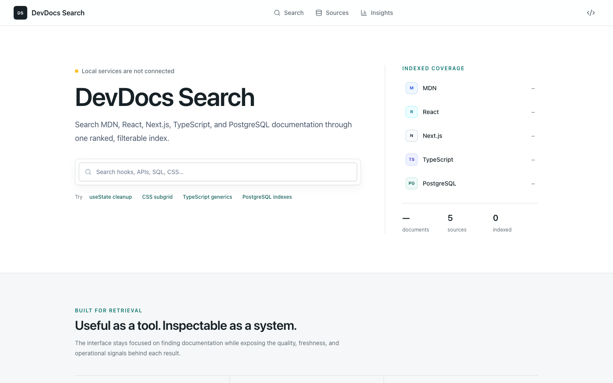
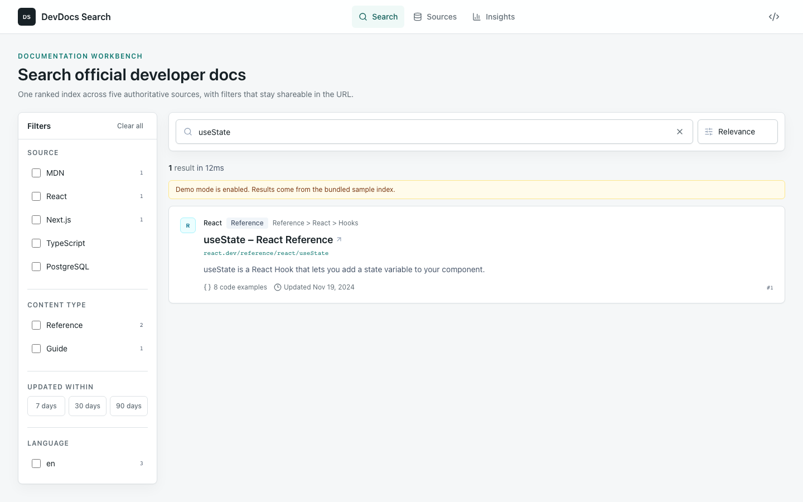
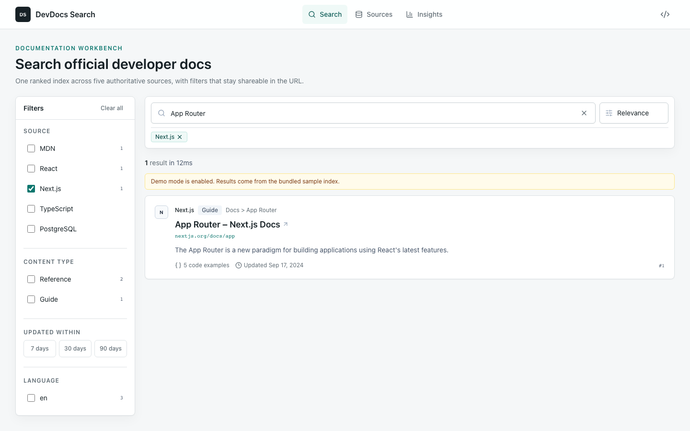
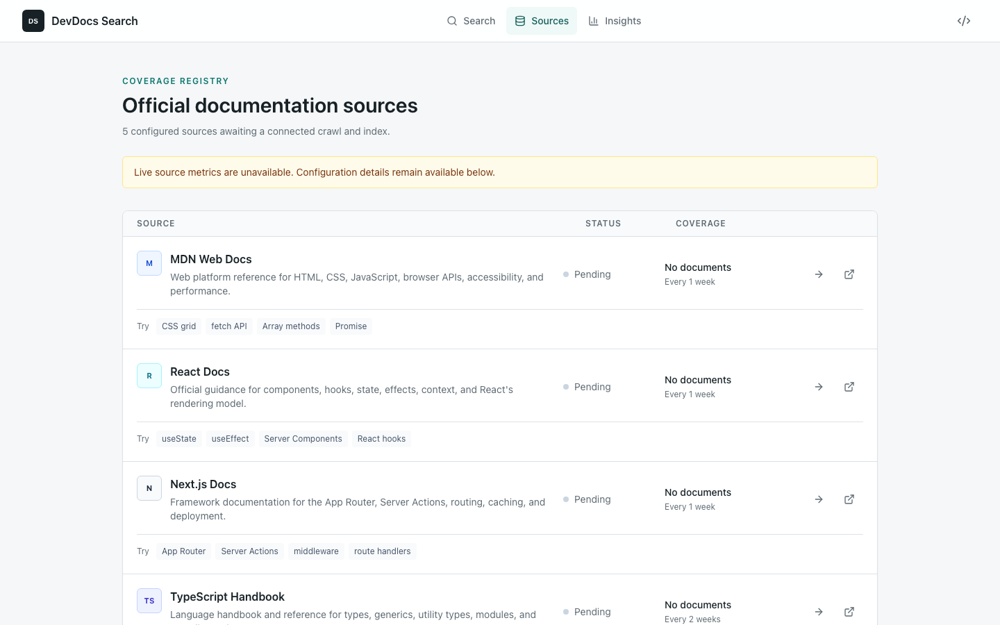

# DevDocs Search

A developer documentation search workbench backed by a real crawler, PostgreSQL document store, Meilisearch index, and search-quality analytics.

DevDocs Search unifies official MDN, React, Next.js, TypeScript, and PostgreSQL documentation in one ranked and filterable interface. The product is designed to be useful as a search tool while keeping its retrieval and ingestion architecture inspectable.



## Product

- Explicit query submission with keyboard-accessible autocomplete
- Source, content type, language, and freshness filters encoded in the URL
- Highlighted excerpts, source provenance, freshness, code-example counts, and match explanations
- Responsive filter drawer, bounded pagination, loading, retry, empty, degraded, and unavailable states
- Source registry with crawl health, coverage, cadence, and scoped search workspaces
- Search-quality dashboard with zero-result rate, click-through rate, and p50/p95 latency
- Explicit opt-in demo mode that never masks a production search outage

### Search results



### Filtered retrieval



### Source registry



### Quality dashboard


## Architecture

```text
YAML source registry
        |
        v
Python async crawler ---> PostgreSQL ---> Meilisearch
  queue / robots /         metadata,      full-text index,
  extraction / retries     content,       facets, ranking
                           analytics
                                \             /
                                 \           /
                                  Next.js API
                                       |
                                       v
                                Search workbench
```

| Layer | Technology |
|---|---|
| Ingestion | Python 3.11, httpx, BeautifulSoup, trafilatura |
| Database | PostgreSQL 16 |
| Search | Meilisearch 1.11 |
| Web | Next.js 15, React 19, TypeScript, Tailwind CSS |
| Validation | Zod, pytest, Vitest, Playwright, Axe |
| Local infrastructure | Docker Compose |

See [architecture](docs/architecture.md), [API contracts](docs/api-spec.md), and [schema](docs/schema.md) for implementation details.

## Ranking

Searchable attributes are ordered by intent: title, headings, section path, source name, description, body, and tags. Meilisearch applies word coverage, typo tolerance, proximity, attribute priority, and exactness before source authority and document quality break close matches.

Explicit date sorting is used only for newest/oldest modes. Relevance searches do not pass a sort clause that could override textual relevance.

## Analytics

Each non-empty live query creates one `search` event and returns a random `searchId`. Result clicks create linked `result_click` events with document ID and rank. An HTTP-only random session cookie supports anonymous session-level analysis without collecting personal information.

Empty page loads, aborted requests, demo results, and automatic refreshes are excluded. Insights are calculated from search events only, so click rows cannot inflate query totals.

## Quick Start

### Requirements

- Docker with Docker Compose
- Node.js 20+
- Python 3.11+ for running the crawler outside Docker

### Docker demo

```bash
bash scripts/local-demo.sh
```

Open `http://localhost:3000`. The script starts PostgreSQL, Meilisearch, the web app, initializes schema and index settings, loads official seeds, and runs the crawler.

For an offline 10,000-document synthetic corpus:

```bash
python -m venv .venv
source .venv/bin/activate
pip install -r services/crawler/requirements.txt
bash scripts/local-demo-10k.sh
```

Stop and remove local data:

```bash
docker compose down -v
```

### Manual services

```bash
docker compose up -d postgres meilisearch
python services/crawler/scripts/init_db.py
python services/crawler/scripts/init_index.py
python services/crawler/scripts/load_seeds.py
python services/crawler/scripts/run_crawl.py
npm run dev
```

## Configuration

| Variable | Default | Purpose |
|---|---|---|
| `DATABASE_URL` | local PostgreSQL | Crawl state, documents, sources, analytics |
| `MEILI_HOST` | `http://localhost:7700` | Meilisearch endpoint |
| `MEILI_MASTER_KEY` | local development key | Meilisearch authentication |
| `SEARCH_DEMO_MODE` | `false` | Enable bundled sample results explicitly |
| `SEARCH_TIMEOUT_MS` | `4000` | Search request timeout |
| `DATABASE_TIMEOUT_MS` | `5000` | Database connection/query timeout |
| `CRAWLER_USER_AGENT` | project contact URL | Crawler identity |
| `CRAWLER_MAX_DEPTH` | source/default value | Global depth override |
| `CRAWLER_CONCURRENCY` | `5` | Concurrent queue items |
| `CRAWLER_RATE_LIMIT_PER_DOMAIN_MS` | source/default value | Global rate override |
| `CRAWLER_MAX_RETRIES` | `3` | Retry limit for transient failures |
| `CRAWLER_IGNORE_ROBOTS` | `false` | Local-only robots override |
| `MEILI_TASK_TIMEOUT_MS` | `30000` | Index task completion timeout |
| `SEED_CONFIG_PATH` | `services/crawler/seeds/docs_sources.yaml` | Source registry path |

Source-specific domains, depth, delay, authority, cadence, and seeds live in `services/crawler/seeds/docs_sources.yaml`. Invalid or out-of-domain seeds fail before crawling starts.

## Reliability

- Search, facets, autocomplete, analytics, and status fail independently.
- PostgreSQL stores documents as `stored` until Meilisearch confirms indexing.
- Failed index tasks mark documents `index_failed` and keep source coverage honest.
- Meilisearch settings and document writes wait for task completion.
- Queue retries use capped exponential backoff; interrupted `processing` rows are recovered.
- Source health records attempts separately from last successful crawls.
- Production search outages return structured `503` responses instead of sample data.

Recovery commands:

```bash
python services/crawler/scripts/init_db.py       # apply additive migrations
python services/crawler/scripts/init_index.py    # reconcile index settings
python services/crawler/scripts/load_seeds.py    # restore configured seeds
python services/crawler/scripts/run_crawl.py     # resume pending/recovered work
curl http://localhost:3000/api/status            # compare service health/counts
```

## Verification

```bash
npm run lint
npm test
npm run build
npm run test:e2e

ruff check services/crawler/app services/crawler/tests
python -m pytest services/crawler/tests -q
```

The browser suite runs desktop and mobile Chromium flows, checks horizontal overflow, exercises search and mobile filters, and audits primary pages against WCAG A/AA rules with Axe.

## API

```text
GET  /api/search
GET  /api/autocomplete
GET  /api/filters
GET  /api/sources
GET  /api/insights
GET  /api/status
POST /api/analytics
```

Requests are bounded with shared Zod schemas. Errors use a consistent `{ error: { code, message, details? } }` envelope.

## Deployment

Deploy the Next.js app with `DATABASE_URL`, `MEILI_HOST`, and `MEILI_MASTER_KEY`. Keep `SEARCH_DEMO_MODE=false` in production. Run PostgreSQL migrations through `init_db.py`, initialize Meilisearch settings through `init_index.py`, and schedule the crawler with the same source registry and service credentials.

The crawler exits `0` when all active source work is healthy, `1` when sources fail, `2` for configuration errors, and `130` after an interrupt.
