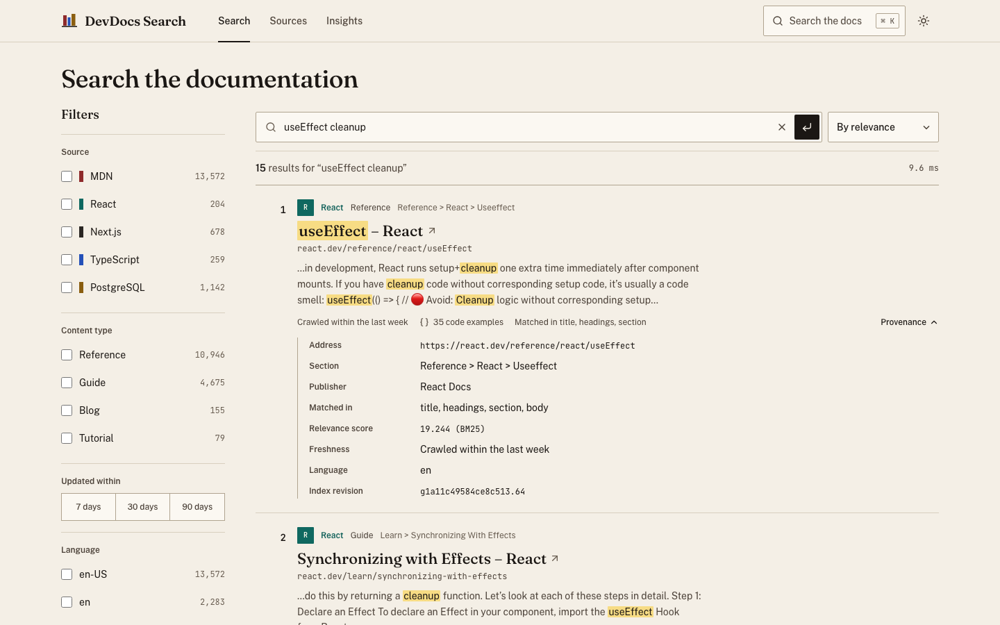
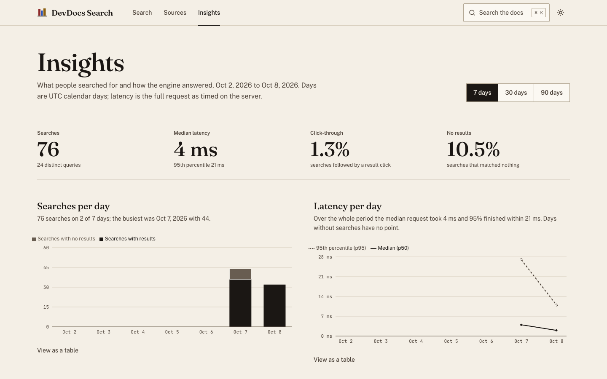

# DevDocs Search


*Recorded from the running application against the real index. Regenerate with `apps/web/scripts/record-tour.mjs`.*

One search box over the official documentation for MDN, React, Next.js, TypeScript, and PostgreSQL.

The retrieval engine, the index format, and the crawler are written in this repository. There is no hosted search service behind it: a TypeScript inverted index ranks with field-weighted BM25, a Python crawler feeds it through PostgreSQL, and a Next.js app serves it.

## Measured

Everything below was measured on this codebase and is reproducible from the scripts linked in each row.

| | Result | Conditions |
|---|---|---|
| Corpus | **15,855** unique documents | Crawled from the five official sites, `robots.txt` honored, at most one request per second per site. No synthetic documents. PostgreSQL, the published index, and the running app report the same count. [Report](docs/evidence/corpus/corpus-report.md) |
| Query latency | **3.5 ms** mean, 5.5 ms p95 | Full HTTP round trip at 10,001 documents, concurrency 1, production build, 3 trials × 500 warmed requests over a fixed 40-query set. [Benchmark](docs/evidence/benchmarks/benchmark.md) |
| Engine time | **1.5 ms** mean | The search engine's own execution time for the same requests |
| Scaling | **−5.9%** from 5,000 (3.7 ms) to 10,001 documents (3.5 ms); 3.9 ms at 15,855 | Same harness. Mean of trial means |
| Concurrency 10 | 15.3 ms mean, 650 requests/s | 10,001 documents, one engine worker |
| Cold start | 1.7 s to load 10,001 documents | Engine hydration at server start. A loaded index then applies a 250-document batch in about 55 ms. [Profile](docs/evidence/benchmarks/hydration.md) |
| Relevance | 16 of 18 expected documents in the top 5 | `scripts/eval_relevance.py` against the full corpus |

Hardware: Apple M1 Pro, 16 GB, client and server on the same machine. These are single-machine numbers, not a production service level. A 20,000-document run is not reported because the five sources hold 15,855 in-scope pages.

## What is in here

### A search engine (`packages/search-engine`)

- Tokenizer, postings lists with per-field term frequencies packed into typed arrays, and document-length statistics, built incrementally.
- **BM25F** ranking with `k1 = 1.2`, `b = 0.75`. Title counts 4×, headings and description 2×, body, tags, section, and source name 1×. Weights are applied before saturation, so repeating a term in the title saturates once rather than once per field.
- A bounded heap keeps only the requested page while scoring; `totalHits` is exact.
- Filters (source, type, domain, language, tags, date range, updated-within), date sorting, prefix autocomplete over titles, and escaped highlighting.
- Bounded typo recovery: only for terms the index has never seen, only the closest spellings, at a score penalty. Exact matches always win.
- Runs in one worker thread per server process. The index is loaded once and kept in memory; searches and updates are serialized on that thread, so a search never observes a half-applied batch.

```text
tf'(t, d) = Σ over fields f of  w_f · tf(t, d, f) / (1 − b + b · len(d, f) / avglen(f))
score(d)  = Σ over query terms of  ln(1 + (N − df + 0.5) / (df + 0.5)) · tf' · (k1 + 1) / (k1 + tf')
```

The tests include rankings worked out by hand from this formula ([`test/bm25.test.ts`](packages/search-engine/test/bm25.test.ts)), and `search-index explain` prints every input for any query and document.

### A crawl and publication pipeline (`services/crawler`)

- Sources are declared in one YAML registry: allowed domains, path prefixes, sitemaps, depth, and rate limit.
- Pages are stored under their canonical URL. Pages with identical extracted text are recorded as duplicates and kept out of the index.
- Documents are written to PostgreSQL as `stored`, then published in **immutable batches of up to 250** behind a manifest that is replaced atomically. A document becomes `indexed` only after its batch is durably on disk.
- A failed or interrupted publication leaves documents retryable; the next run publishes them. Publishing twice replaces, never duplicates.
- Blocking work runs off the event loop, behind a bounded queue, so a slow disk slows the crawl instead of growing memory.
- Streaming rebuild, compaction, and verification commands. PostgreSQL is the source of truth and the index can always be rebuilt from it.

### An interface (`apps/web`)

| | |
|---|---|
|  |  |
| Home. Spine widths are the live document counts. | Results. Each entry can show where it came from, which fields matched, its score, and the index revision. |
|  |  |
| A source workspace, locked to one source. | Insights from recorded searches, in UTC daily buckets. |

- Search state lives in the URL. Submitting a query, changing a filter, and paging each push a history entry.
- A workspace's source is implied by its route and cannot be changed by a crafted URL or by clearing filters.
- Insights cover 7, 30, or 90 days. Period percentiles come from the underlying events, not from averaging daily values.
- A statistic that is missing is left out. A service that is down is shown as unavailable, never as zero.
- WCAG 2.2 AA: keyboard operable, focus-managed dialogs, reduced-motion support, Axe-checked in both themes.

More screenshots: [sources](docs/assets/sources.png), [home, dark](docs/assets/home-dark.png), [mobile search](docs/assets/mobile-search.png), [mobile home, dark](docs/assets/mobile-home-dark.png).

## How a page becomes a result

```text
source registry (YAML)
        |
        v
Python crawler ──> PostgreSQL ──> batch publisher ──> SEARCH_INDEX_DIR
 robots, scope,     source of       ≤250 docs/batch     manifest.json
 rate limits,       truth           fsync + rename      batches/*.jsonl
 dedup, retries                                               |
                                                              v
                              Next.js server ── worker thread: inverted index + BM25
```

| Layer | Technology |
|---|---|
| Retrieval | TypeScript, Node worker threads |
| Ingestion | Python 3.11+, httpx, BeautifulSoup, trafilatura |
| Storage | PostgreSQL 16 |
| Web | Next.js 15, React 19, Tailwind CSS, Radix primitives, Motion, Recharts |
| Tests | Vitest, pytest, Playwright, Axe |

Details: [architecture](docs/architecture.md) · [index format and operations](docs/native-index.md) · [API](docs/api-spec.md) · [schema](docs/schema.md).

## Run it

Requirements: Docker, Node.js 20+, Python 3.11+.

### With Docker

```bash
bash scripts/local-demo.sh
```

This starts PostgreSQL and the web app, then crawls the five sources into a volume the web app reads. Open http://localhost:3000. The crawl is polite and therefore slow (about 1 page per second per site); the app is usable while it runs, and the crawl can be interrupted and resumed.

### By hand

```bash
npm install
python -m venv .venv && source .venv/bin/activate
pip install -r services/crawler/requirements.txt

docker compose up -d postgres            # POSTGRES_PORT=5433 if 5432 is taken
python services/crawler/scripts/init_db.py
python services/crawler/scripts/load_seeds.py
python services/crawler/scripts/run_crawl.py

npm run build && npm run start           # or: npm run dev
```

Set `DATABASE_URL` for both the crawler and the web app if PostgreSQL is not on the default port. Both sides default the index to `data/search-index` in the repository.

### Without crawling

A deterministic 10,000-document **synthetic** fixture exists for exercising the engine at a fixed size. It is generated text, kept in a separate index directory, and is not part of any number above.

```bash
bash scripts/local-demo-10k.sh
```

## Configuration

| Variable | Default | Purpose |
|---|---|---|
| `SEARCH_BACKEND` | `native` | `native` or `meilisearch`. Fixed for the life of the process; a failing backend returns `503` and is never swapped for the other |
| `SEARCH_INDEX_DIR` | `<repo>/data/search-index` | Directory shared by the crawler (writer) and the web server (reader) |
| `SEARCH_INDEX_POLL_MS` | `1000` | How often the engine checks for new batches |
| `SEARCH_TIMEOUT_MS` | `4000` | Search request timeout |
| `DATABASE_URL` | local PostgreSQL | Documents, crawl state, sources, analytics |
| `DATABASE_TIMEOUT_MS` | `5000` | Database timeout |
| `INDEX_TARGETS` | `native` | Where the crawler publishes: `native`, `meilisearch`, or both |
| `CRAWLER_USER_AGENT` | project contact URL | Crawler identity |
| `CRAWLER_CONCURRENCY` | `5` | Queue items processed together |
| `CRAWLER_MAX_RETRIES` | `3` | Retries for transient failures |
| `CRAWLER_MIN_WORDS` | `20` | Pages with less extracted text are skipped |
| `CRAWLER_IGNORE_ROBOTS` | `false` | Local testing only |
| `SEED_CONFIG_PATH` | `services/crawler/seeds/docs_sources.yaml` | Source registry |
| `SEARCH_DEMO_MODE` | `false` | Serve a small bundled sample, labeled as such, when the index is unavailable |

Meilisearch remains available as a comparison backend: `docker compose --profile meilisearch up -d`, `INDEX_TARGETS=native,meilisearch`, `SEARCH_BACKEND=meilisearch`.

## Operating the index

```bash
python services/crawler/scripts/publish_pending.py        # publish anything stored but not indexed
python services/crawler/scripts/rebuild_index.py          # rebuild from PostgreSQL (streaming)
python services/crawler/scripts/compact_index.py --prune  # fold replacements and tombstones
node packages/search-engine/dist/cli.js verify data/search-index
node packages/search-engine/dist/cli.js explain data/search-index "window functions" <document-id>
python services/crawler/scripts/corpus_report.py --since <crawl start> --base-url http://localhost:3000
```

Failure handling, the on-disk format, and the write protocol are in [docs/native-index.md](docs/native-index.md).

## Tests

```bash
npm run typecheck && npm run lint
npm test                 # engine (77) and web (39) unit tests
npm run test:e2e         # 31 browser tests on desktop and mobile Chromium
python -m pytest services/crawler/tests -q    # 45 crawler tests
ruff check services/crawler/app
```

What they cover, beyond the usual:

- BM25 scores checked against hand calculations; term saturation; length normalization; stable ordering among equal scores.
- Replacing and deleting documents leaves the same statistics and scores as building from the final state.
- Corrupt, truncated, and missing batches; failed manifest writes; restart recovery; concurrent hydration; request timeouts.
- A Python-written index read by the Node engine, in both test suites.
- Browser tests run the real engine against a fixture index: history navigation, source lock against crafted URLs, focus trapping in the filter sheet, keyboard shortcuts, theme persistence, reduced motion, and Axe audits in both themes.

## Reproducing the numbers

```bash
npm run build
node scripts/benchmark/run-benchmark.mjs       # writes docs/evidence/benchmarks/benchmark.{md,json}
node scripts/benchmark/profile-hydration.mjs   # writes hydration.{md,json,cpuprofile}
python scripts/eval_relevance.py --base-url http://127.0.0.1:3000
```

The benchmark exports nested samples of the crawled corpus from PostgreSQL, starts a fresh production server for each trial, and measures cold start separately from warmed queries. Analytics writes stay enabled, as they are in normal use. The fixed query set is in [`scripts/benchmark/queries.json`](scripts/benchmark/queries.json). A summary of what the evidence does and does not support is in [docs/evidence](docs/evidence/README.md).

## Limits

- **One machine.** Latency was measured with the load generator on the same host. Network latency and multi-instance behavior are not measured.
- **Memory-resident index.** The server process used about 510 MB at 10,001 documents. The engine needs a long-lived Node process and a volume shared with the crawler; it is not suited to serverless functions as built, where every cold instance would spend 1.7 s loading the index.
- **No stemming.** `index` and `indexes` are different terms. Two of the 18 relevance checks fail, both on queries where the expected page uses a different word form or title.
- **Updates block briefly.** Applying a 250-document batch occupies the engine thread for about 55 ms.
- **English only**, and only the five configured sources.

## API

```text
GET  /api/search         q, page, limit, source, contentType, domain, language, tags, sort, from, to, updatedWithin
GET  /api/autocomplete   q
GET  /api/filters
GET  /api/sources
GET  /api/insights       period=7d|30d|90d
GET  /api/status
POST /api/analytics      { searchId, clickedDocumentId, resultRank }
```

Search responses include `backend`, `indexRevision`, and a per-result `score`. `processingTimeMs` is engine time only. Errors use `{ error: { code, message, details? } }`. Full contracts: [docs/api-spec.md](docs/api-spec.md).

## License

[MIT](LICENSE). Fonts are self-hosted under the SIL Open Font License; see [`apps/web/src/fonts`](apps/web/src/fonts/README.md).
